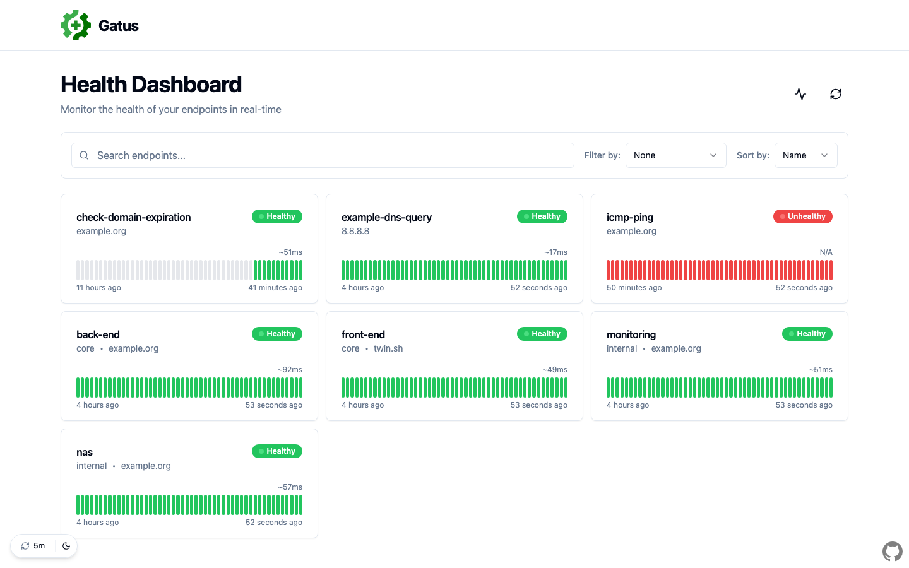

Nexlayer.com
#67 https://github.com/armondhonore/gatus

LIVE URL: https://relaxed-weasel-gatus.cloud.nexlayer.ai

A status page and uptime monitor in a single tiny Go binary. Gatus health-checks your endpoints (HTTP, TCP, DNS, even certs) and shows a clean dashboard with alerting. Config-as-code, one pod, zero fuss.

#250apps #nexlayer #monitoring #golang #opensource

